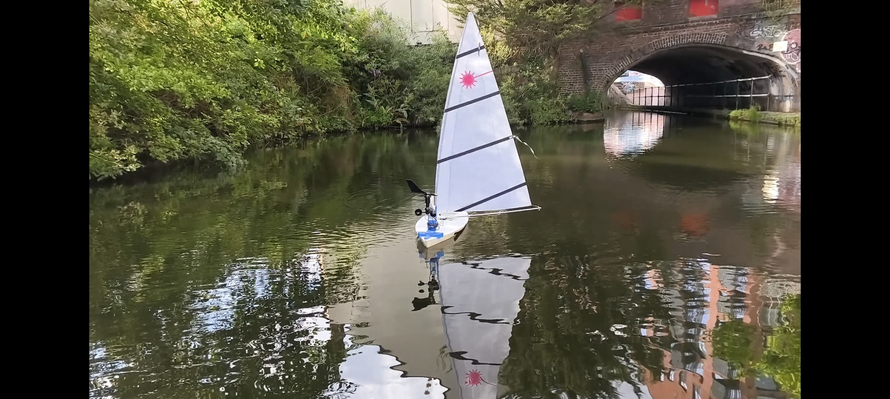

# Autonomous Sailboat Control System

An Arduino-based autonomous sailboat control platform designed for real-world waypoint navigation using live environmental sensing and actuator control.

This project integrates GPS navigation, heading estimation, wind sensing, sail/rudder actuation, and telemetry logging to enable autonomous sailing experiments in physical environments.



---

## Features

- Autonomous waypoint navigation
- GPS-based position tracking
- Compass heading estimation
- Wind direction sensing
- Bearing-to-target calculation
- Distance-to-waypoint calculation
- Rudder steering control
- Sail trim control
- SD card telemetry logging
- Dry-land testing
- Real water deployment validation

---

## System Overview

The control loop continuously reads sensor inputs:

- GPS coordinates
- compass heading
- wind direction
- target waypoint

The navigation logic computes:

- required course/bearing
- remaining distance
- relative wind angle

The control system then adjusts:

- rudder angle
- sail angle

to maintain navigational progress toward the waypoint.

---

## Hardware Components

### Core Hardware

- Arduino Uno
- GPS module
- CMPS12 digital compass
- Davis wind direction sensor
- Davis wind speed sensor
- Rudder servo actuator
- Sail servo actuator
- SD card module
- autonomous sailboat platform

---

## Software Dependencies

Install these Arduino libraries separately:

- TinyGPSPlus
- Adafruit_BNO055
- Adafruit_BusIO
- Adafruit_Sensor
- Adafruit_PWM_Servo_Driver
- PinChangeInterrupt
- ServoInput

Optional / development libraries:

- DHT sensor library
- Grove IMU library
- Seeed Ultrasonic Ranger library

These libraries are intentionally not included in this repository to keep the project lightweight and maintain proper dependency management.

---

## Example Logged Telemetry

The system records:

- latitude
- longitude
- heading
- target bearing
- distance to waypoint
- wind direction
- relative wind angle
- rudder position
- sail position

Example:

```text
Lat: 52.483940
Lng: -1.881937
Heading: 284
Bearing: 157
Distance: 41.12
Wind Dir: 92
Wind Rel: 168
Rudder: 45
Sail: 90
```

---

## Validation

Testing performed:

### Dry Test
Control logic validation with stationary sensor input and actuator response checks.

### Water Test
Real-world autonomous sailing experiments with live GPS navigation and wind-based control adjustments.

---

Note: Some of the images used, are based on this repo: https://github.com/TitouanLeost/Aston-Autonomous-Sailboat-2024
